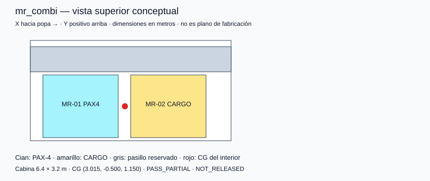
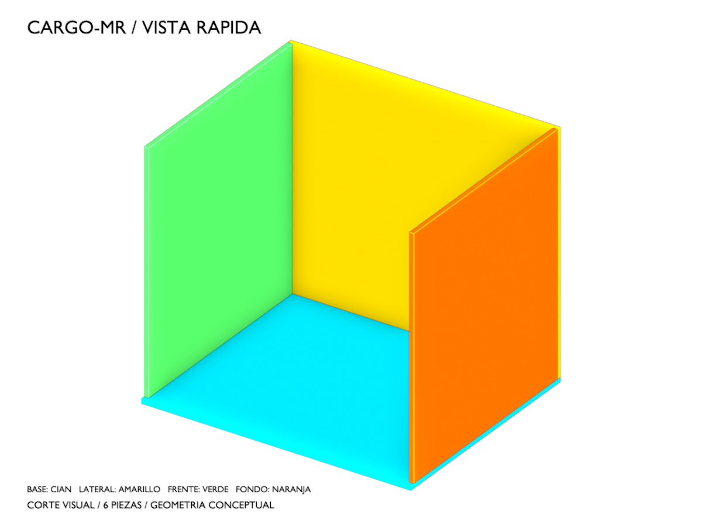

# A-BYSS / BlackMamba Aerospace

**Infraestructura aeroespacial civil · Arquitectura modular · Investigación**

> W-HALE lifts, M-RAY travels, T-SHARK moves fast, A-BYSS connects.

Una familia de vehículos especializados para conectar Tierra, atmósfera, órbita y espacio cislunar. A-BYSS coordina recursos y servicios; W-HALE eleva, M-RAY transporta y T-SHARK atiende misiones de respuesta rápida.

**Estado:** definición conceptual P0 · **Versión documental:** 0.9.0 · **Actualización:** 2026-10-07. Repositorio público. Los objetivos de diseño no son prestaciones demostradas; todavía no hay hardware ni simuladores de vuelo validados.

## Familia y capacidades objetivo

| Plataforma | Entorno y misión | Interior de referencia propuesto | Configuraciones |
|---|---|---|---|
| W-HALE-T | Aeronave atmosférica de transporte | 8 posiciones WH; hasta 32 plazas objetivo | PAX / CARGO / COMBI |
| W-HALE-L | Portador atmosférico de etapa de lanzamiento | Integración específica de carga/etapa | LAUNCH; no se asume combinación con pasajeros |
| M-RAY | Transporte orbital/cislunar | 2 posiciones MR; hasta 8 plazas objetivo | PAX / CARGO / COMBI |
| T-SHARK | Inspección y logística orbital rápida | 1 posición TS; hasta 4 plazas objetivo | PAX / CARGO / SERVICE |
| A-BYSS | Hub orbital de recursos y mantenimiento | Puertos y zonas de servicio compatibles | Recepción, almacenamiento y mantenimiento |

**Cuatro asientos por módulo** es la base para estudiar interiores; la tripulación operativa, si existe, se contabiliza aparte. Posiciones, geometría y capacidad están por validar. La carga en kg depende de masa, volumen, ruta, duración, reservas, sujeciones y servicios.

El primer P0 sigue siendo logístico y sin tripulación. Los interiores humanos se estudian como variantes futuras. W-HALE necesita una etapa externa para llegar a órbita; M-RAY y T-SHARK no se presuponen aeronaves atmosféricas por tener asientos.

## Asientos ↔ carga

Estructura y sistemas de vuelo permanentes, interior de misión intercambiable. Cada posición compatible recibe PAX-4, CARGO o SERVICE; se combinan dentro de configuraciones verificadas.

```text
W-HALE transporte: [P4][P4][P4][P4][P4][P4][P4][P4] → 32 plazas objetivo
W-HALE mixto:      [P4][P4][P4][P4][ C][ C][ C][ C] → 16 plazas + carga
M-RAY mixto:       [P4][ C]                         →  4 plazas + carga
T-SHARK carga:     [ C]                            → carga rápida
```

Inventario lógico, no plano físico ni balance longitudinal. WH, MR y TS son clases distintas: comparten manifiesto y lógica; su compatibilidad mecánica debe demostrarse. Conversión inicial en tierra, sin ocupantes, con inspección y liberación posteriores.

## Documentación

| Documento | Contenido |
|---|---|
| [Carga descentrada](docs/IF11_ECCENTRIC.md) | 144 casos, reparto por perno y apertura local |
| [Material y precarga candidatos](docs/IF11_CANDIDATE.md) | Variante B, referencias y límites axiales |
| [Anclaje IF-11](docs/IF11_ANCHOR_STUDY.md) | Tres variantes, 162 casos y masas parciales |
| [Mecánica rápida](docs/FAST_MECHANICS.md) | Seis filtros escalares, supuestos y ejecución |
| [Comparación mecánica](evidence/mechanics/README.md) | Tabla y barras: demo frente a datos pendientes |
| [Puente Mamba3D](docs/MAMBA3D_BRIDGE.md) | 3defect → Blender → medición de retorno |
| [CARGO-MR editable](assets/cargo-mr/README.md) | Primer .blend, GLB y preview generados |
| [Geometría y balance](docs/GEOMETRY_AND_BALANCE.md) | Layouts, aperturas y CG del interior |
| [Diagramas y casos](evidence/P0-021/README.md) | Tres layouts y un caso de descarga desequilibrada |
| [SIZING_BASELINE.md](docs/SIZING_BASELINE.md) | Hipótesis de masa/volumen, cálculo y límites de uso |
| [Reporte exploratorio](evidence/P0-022/README.md) | Ocho configuraciones reproducibles; P0-022 sigue abierto |
| [FLEET.md](docs/vehicles/FLEET.md) | Vehículos, variantes y objetivos de capacidad |
| [MODULAR_PAYLOAD.md](docs/MODULAR_PAYLOAD.md) | Catálogo, layouts, cálculo y procedimiento de conversión |
| [IF-11](interfaces/IF-11_MODULAR_CABIN.md) | Contrato entre posición y módulo |
| [ARCHITECTURE.md](ARCHITECTURE.md) | Sistema, interfaces y modos |
| [ROADMAP.md](ROADMAP.md) | Fases, entregables, gates y dependencias |
| [P0_REQUIREMENTS.md](P0_REQUIREMENTS.md) | 25 requisitos propuestos |
| [ADR-001](decisions/ADR-001-modular-payload.md) | Justificación de la unidad de cuatro plazas |
| [Fuentes](docs/REFERENCES.md) | Referencias primarias y límites de uso |
| [CHANGELOG.md](CHANGELOG.md) | Evolución documental |

## Calculador exploratorio

Modelo Python sin dependencias externas para comparar masa y volumen del interior. Todas las asignaciones son hipotéticas; el resultado no es capacidad de vuelo ni liberación de configuración.

```bash
python3 software/payload_budget.py --vehicle MR --pax-modules 1 --cargo-density 100
python3 -m unittest discover -s tests -v
python3 software/generate_payload_report.py
```

Consultar [hipótesis, fórmulas y exclusiones](docs/SIZING_BASELINE.md). El código aplica el margen una vez, descuenta módulos/ocupantes y limita carga por masa local, masa total y volumen. El verificador adicional evalúa cajas, aperturas y CG del interior; siguen pendientes estructura, recorrido de acceso, CG total y desempeño de misión.

## Layouts y balance



```bash
python3 software/layout_check.py models/layouts/mr_combi.json
python3 software/generate_layout_report.py
```

Veinte pruebas de software cubren presupuesto, distribución, colisiones, aperturas y datos inválidos. El caso `wh_unbalanced_unload` falla deliberadamente: descargar un lateral puede sacar el CG del interior de su ventana hipotética aunque reduzca la masa. No se calcula todavía el CG del vehículo completo.

## Bridge 3D ejecutable



```bash
python3 bridges/run_cargo_mr.py --provider /ruta/al/checkout/3defect
```

El puente convierte la geometría de A-BYSS al contrato Mamba3D, usa las primitivas de 3defect, genera Blender/GLB y reabre el `.blend` en otro proceso para medir dimensiones y referencias. [Contrato y límites](docs/MAMBA3D_BRIDGE.md). La medición digital no acredita fabricación ni operación.

## Siguiente gate

Validar la geometría candidata, demostrar el recorrido de acceso y derivar límites de masa, piso, anclajes y servicios por clase. Con la misión y presupuestos cerrados se publicará carga neta en kg por configuración. Ningún requisito está aprobado sólo por estar documentado.

## Participar y citar

Usar [issues](https://github.com/Blackmvmba88/a-byss/issues), [CONTRIBUTING.md](CONTRIBUTING.md) y la plantilla de pull request. Metadata: [project.json](project.json). Cita: [CITATION.cff](CITATION.cff).

**Licencia:** pendiente de elección del titular; el proyecto todavía no declara una licencia de reutilización. La publicación no se presenta como concesión de una licencia open source. No se atribuyen certificaciones, DOI ni afiliaciones institucionales.
