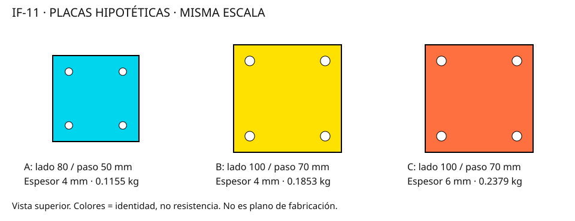

# IF-11 — tres variantes de estudio

Datos hipotéticos, masas parciales. NOT_RELEASED. Ninguna variante queda aprobada.

| Variante | Masa parcial (kg) | Peor índice separación | Casos ≥1 / total |
|---|---:|---:|---:|
| A | 0.1155 | 2.571 | 33 / 54 |
| B | 0.1853 | 1.543 | 15 / 54 |
| C | 0.2379 | 1.543 | 15 / 54 |

B y C tienen igual resultado de separación porque comparten precarga y rango de rigidez supuesto. El espesor extra de C sólo cambia la masa en este modelo; su efecto estructural está pendiente.

El conteo representa puntos de una cuadrícula, no probabilidad de fallo. Los valores de torsión no alteran el filtro axial independiente.

[Hipótesis, límites y siguiente ensayo](../../docs/IF11_ANCHOR_STUDY.md).
