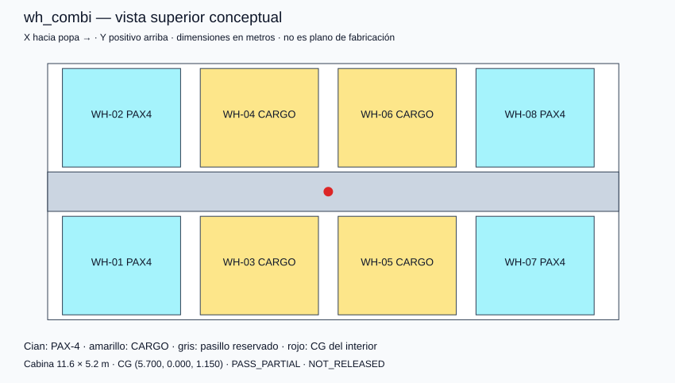
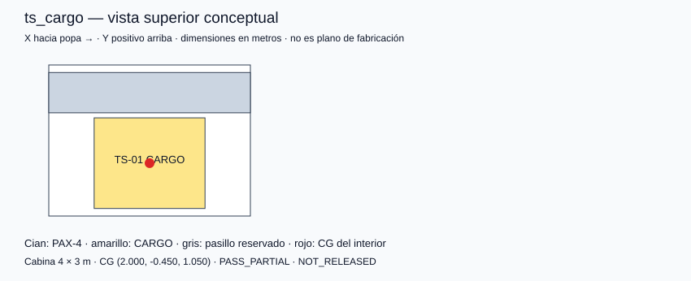
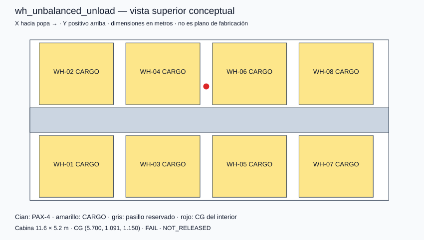

# P0-021 / P0-022 — evidencia parcial de layout

Requisitos abiertos. Geometría rectangular hipotética y CG del interior; no se evalúa el CG del vehículo completo ni el recorrido de instalación.

| Caso | Masa interior kg | CG X/Y/Z m | Resultado parcial |
|---|---:|---|---|
| wh_combi | 6720 | 5.700/0.000/1.150 | PASS_PARTIAL |
| mr_combi | 1880 | 3.015/-0.500/1.150 | PASS_PARTIAL |
| ts_cargo | 700 | 2.000/-0.450/1.050 | PASS_PARTIAL |
| wh_unbalanced_unload | 4400 | 5.700/1.091/1.150 | FAIL |

El caso de descarga unilateral falla el rango Y hipotético: conservar masa admisible no garantiza equilibrio. Ningún caso libera operación.

[Hipótesis y alcance](../../docs/GEOMETRY_AND_BALANCE.md) · [Resultados y hashes](layout_results.json).

Reproducir: `python3 software/generate_layout_report.py`.

## wh_combi

## mr_combi

## ts_cargo

## wh_unbalanced_unload

