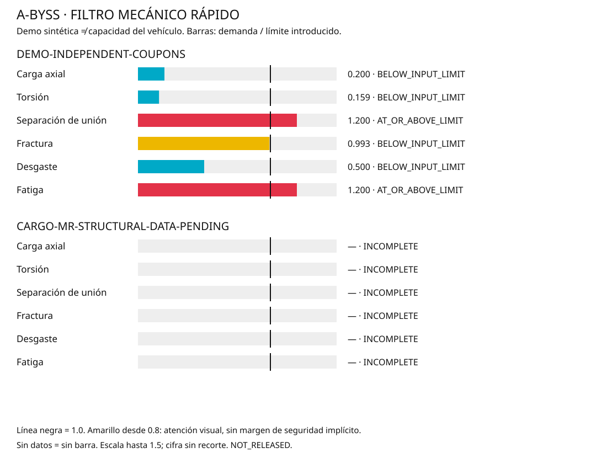

# Comparación mecánica rápida

Ejemplos escalares independientes. No son una evaluación estructural de CARGO-MR.

| Caso | Modo | Utilización | Estado |
|---|---|---:|---|
| demo | Carga axial | 0.200 | BELOW_INPUT_LIMIT |
| demo | Torsión | 0.159 | BELOW_INPUT_LIMIT |
| demo | Separación de unión | 1.200 | AT_OR_ABOVE_LIMIT |
| demo | Fractura | 0.993 | BELOW_INPUT_LIMIT |
| demo | Desgaste | 0.500 | BELOW_INPUT_LIMIT |
| demo | Fatiga | 1.200 | AT_OR_ABOVE_LIMIT |
| cargo_mr | Carga axial | — | INCOMPLETE |
| cargo_mr | Torsión | — | INCOMPLETE |
| cargo_mr | Separación de unión | — | INCOMPLETE |
| cargo_mr | Fractura | — | INCOMPLETE |
| cargo_mr | Desgaste | — | INCOMPLETE |
| cargo_mr | Fatiga | — | INCOMPLETE |

CARGO-MR permanece incompleto: faltan cargas, materiales y caracterización de uniones.

La carga axial recibe una fuerza conocida; no calcula el empuje de un motor. Los colores del modelo 3D identifican piezas, no tensiones.

[Métodos, supuestos y ejecución](../../docs/FAST_MECHANICS.md).
